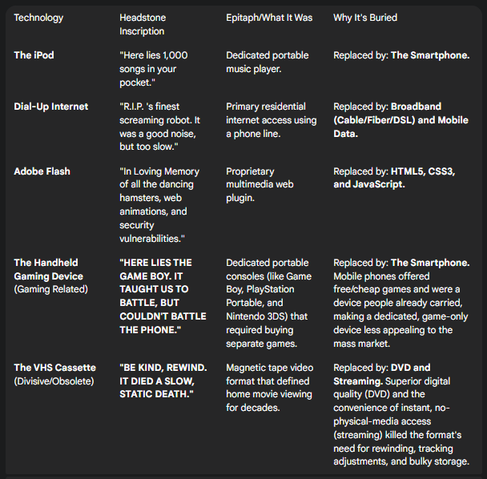

# Scene 71 - B.L.O.R.T - Broken Land of Relic Tech

A lush graveyard for heroes of the past; games, devices, startups that have been berried long ago

## Island Location

### Neighbours

Scene 30 - Finished
Scene 15 - Finished
Scene 56 - Finished
### Landscape & Location

A small green island on the North East tip of the map. 
Located between the alps in the snowy biome, the suculent forests of the mainland and a twin island '_The Land of Obese Plants_'. 

On the land of this island there is a small gravyard of tech relics that have failed to keep up, were never deemed popular enough for widespread attention or couldn't keep up with the ever changing world we live in now.

## Coding

### Tech Stats

1. HTML
2. CSS (_inside the HTML tho_)

### Code Plan

- Background (image or colour) ✅
- Choose Tech (bellow) ✅
- Hover over grave to display info ❌
- Island Lay out ❌
- Extra info (neighbours, SOM details) ✅

### What Tech?

and the blackberry